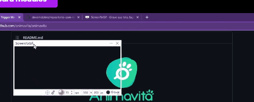

# Projeto com README
Um preojeto de teste com um arquivo README 😎😎😎

[]

## Tecnologias utiizadas 
- HTML
- CSS
- JS

## Como Utilizar

- Clone o projeto 
```

- git clone <url>
```

- Acesse a pasta do projeto
```

- cd repositorio-com-readme
```


